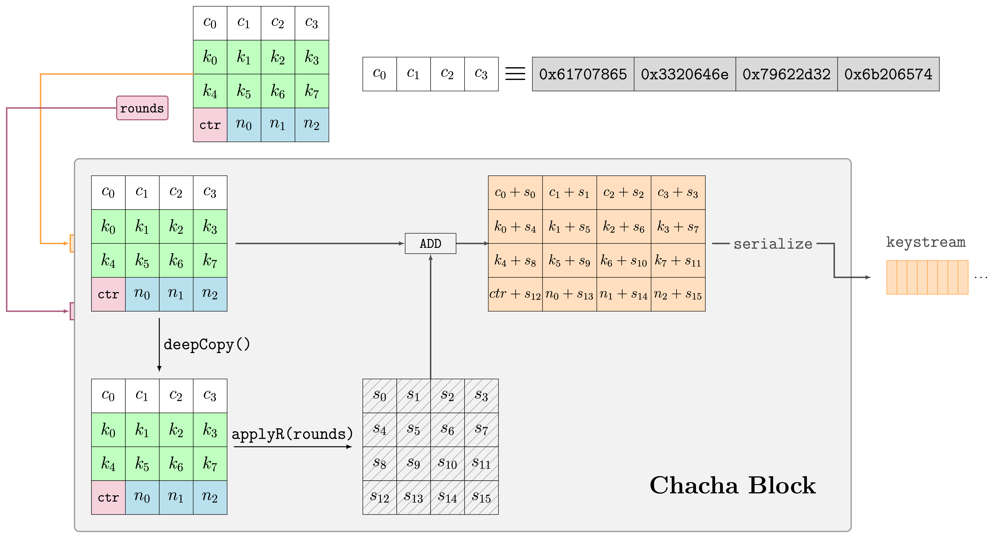

#  ChaCha20-Poly1305/2133 Optimization - Advanced Systems Lab

Project Work for MSc Advanced Systems Lab course offered at ETH Zurich (263-0007-00L). For details on implementation, algorithm, optimizations and evaluation check out report.pdf.

> **Important:** This is a performance-optimization project, not a production-ready cryptographic library. Use a maintained library such as OpenSSL for security-critical, time-constant applications.

## Project goal

Design, implement and optimize the ChaCha20-Poly1305 Authenticated Encryption with Associated Data (AEAD) scheme. Specifically, 
1. Provide a baseline of the code which is compliant with the  specifications [RFC8439](https://datatracker.ietf.org/doc/html/rfc8439).  
2. Create a first optimized version of the implementation using the techniques learned during the course, such as ILP, inlining, precomputation, memory optimizations.
3. Create a fully optimized vectorized code, using the best SIMD/AVX combination possible. 
4. Extend the Poly1305 code to support an additional prime field.
5. Compare with existing state-of-art implementations such as OpenSSL.


  
## Repository layout

  
```text
optimizations/ (base implementation + optimizations of specific implementation based on techniques learned in class.)
	|---chacha20/ ChaCha20 block and encryption variants
	|---poly1305/ Poly1305 initialization, tag, and OpenSSL benchmarks
	|---poly2133/ Poly2133 initialization and tag variants
	|---chacha20-poly1305/ ChaCha20-Poly1305 AEAD composition
	|---chacha20-poly2133/ ChaCha20-Poly2133 AEAD composition

tests/ (RFC and project-generated correctness tests. Poly2133 isn't standardized and test cases where generated using the corresponding python script)
time/ (Benchmarking, operation count and plots. Manual counting of integer operations. In this implementation, integer operations are the overhead and were used to compute performance of peak measured in iops/cycle.)
figures/ (Benchmark plots and chacha20-poly1305 visualization)
```

##  Requirements

The build is not general purpose! We have strong assumptions that require us to make certain optimizations/code elimination as well as use vectorization. Namely, we assume 
1. Host machine is little endian
2. Host machine has 64-bit instruction set
3. Host's ISA supports Intel® AVX2
4. Host's architecture has 4 ALU scalar Ports, 3 ALU vectorized ports

**We don't handle other cases, nor check that those assumptions hold true.** The measurements in [`report.pdf`](./report.pdf) were collected on an Intel Core i7-7700HQ (Kaby Lake) using GCC 13.3.0. **They are architecture and compiler-dependent; they should be treated as reference measurements, not portable performance guarantees.**

## How to run
  
1. **Tests** (ChaCha20 state initialization, quarter rounds, block generation, serialization, encryption, Poly1305 key/tag generation, AEAD encryption/decryption, and Poly2133 tag generation): 

```bash
make test
```
  
  2. **Benchmarks**
  
```bash
# ChaCha20
make bench-chacha-block
make bench-chacha-encrypt-solo
make bench-chacha-encrypt

# Poly1305
make bench-poly1305-init
make bench-poly1305-create-tag
make bench-poly1305-complete-choose-len

# Poly2133
make bench-poly2133-init
make bench-poly2133-create-tag

# Complete AEAD paths
make bench-aead-encrypt-solo
make bench-aead-encrypt
make bench-chacha-poly2133-encrypt
```

  
Benchmark CSV files are written in `time/*/data` 

## Notable Results   


- The best ChaCha20 encryption variant reached approximately 40% of the available vectorized peak.
- ChaCha20-Poly1305 reached a peak of 9.92 operations/cycle and approximately 73% of the measured OpenSSL performance.
- The optimized Poly1305 authenticator achieved about a 10x speedup over the baseline and approximately 50% of the theoretical SIMD peak.
- ChaCha20 encryption outperformed the tested OpenSSL configuration for plaintexts below 8 KiB and retained roughly 80% of its throughput for larger inputs.
- Poly2133 scalar optimizations approached the scalar peak; register pressure limited the vectorized implementation to approximately 30% of its theoretical maximum.


## Learnings


- ChaCha20 benefits from exposing independent quarter rounds and blocks, but its state dependencies constrain how much ILP can be extracted.
- Poly1305 and Poly2133 are compute-bound large-integer workloads where limb layout, carry scheduling, and register pressure dominate performance.
- Delaying carries and evaluating several blocks together can remove dependency bottlenecks, but it increases live state and can make vectorization harder.
- AVX2 is not automatically faster: lane utilization, reductions, and register pressure determine whether vectorization pays off.
- Operation counts and roofline estimates explain bottlenecks, but measured cycles remain essential because compiler scheduling and microarchitecture affect the result.
- Benchmark conclusions are only meaningful when the compiler flags, CPU, cache conditions, input sizes, and comparison library are recorded.


## FAQ
### 1. How to time poly2133_init, chacha_block, chacha-encrypt functions?

1. Run `make bench-{chacha-block,poly2133-init,chacha-encrypt}`

### 2. How to change range of plaintext lengths that chacha_encrypt is benchmarked for?

1. Go into `time/chacha/run_chacha_benchmarks.py`
2. Change the line `SIZES = [1 << i for i in range(8,11)]` and save file
3. Run `make clean`
4. Run `make bench-chacha-encrypt`

### 3. How to register new optimization for a specific function (e.g. chacha_encrypt)?

The implementations are intentionally organized as named variants so that each optimization can be measured independently:

1. Add the function to the appropriate file under `optimizations/` folder. 
2. Create the new optimized function and documentation on what was optimized for that function.
3. Declare it in the matching header (`*_opts.h` or `*_opt.h`).
4. Register it in the relevant benchmark coordinator under `time/`.
5. Add or update its operation-count function in `time/*/op_computation.py`.
6. Run the correctness tests and the smallest relevant benchmark target.
7. Find the benchmark coordinator for that function (e.g. `optimizations/chacha/main_encrypt.cpp`)
8. Register the function you created following the way its done for other functions.

### 4. Is Poly2133 standardized?

No. Poly2133 is an experimental extension used for this project. Its field, key size, block size, tag size, and generated test vectors are project choices, not RFC-defined requirements.

### 5. Why does `make test` fail on my Mac?

On Apple Silicon, the x86-only AVX2 intrinsics cannot be compiled. Run the project on an AVX2-capable x86-64 host or adapt the SIMD code and Makefile for another architecture. The reported measurements specifically target an Intel Core i7-7700HQ.

### 6. How do I benchmark a single plaintext size?

Use the `*_solo` target, for example:

```bash
make bench-chacha-encrypt-solo
make bench-aead-encrypt-solo
```

  The benchmark executable accepts a plaintext length in bytes. After building, you can invoke it directly, for example:

```bash

./bin/chacha_encrypt_solo_benchmark_runner 4096

```

### 7. How do I compare scalar and vectorized builds?

Run a benchmark target that builds both variants, such as `make bench-chacha-encrypt` or `make bench-aead-encrypt`. The generated `*_3.csv` and `*_3_no_vec.csv` files contain the corresponding measurements.


## Contributors

The report presents the work as a collaborative project and does not assign exclusive ownership of individual files.

| Contributor            | Contribution                                                                                                                                                                                                                                                                                                   |
| ---------------------- | -------------------------------------------------------------------------------------------------------------------------------------------------------------------------------------------------------------------------------------------------------------------------------------------------------------- |
| Flurin Baumann         | Optimizations of chacha encrypt (strength reduction, scalar replacement, unroll and ILP handling multiple plaintext blocks concurrently, first vectorized version), all implementations of Chacha20-Poly2133                                                                                                   |
| Michela Bottan         | Optimizations of Poly1305 create tag (inlining, precomputation, parallel Horner, carry delay, vectorization), cost analysis of Poly1305 with Ioannis.                                                                                                                                                          |
| Ioannis Tsagkaropoulos | Optimizations of chacha block function (inlining, scalar replacement working state, unroll final state addition loop and use ILP), chacha encrypt (inline, final vectorized versions), all optimizations of Poly1305/2133 key init-clamping, all implementations of Chacha20-Poly1305, cost analysis ChaCha20, all plots. |
| Jasmine Ziwalig        | Optimizations of Poly2133 create tag function (limb/implementation choices, inlining, adding ILP, precomputations, 2-level approach, delayed carry, vectorization).                                                                                                                                            |